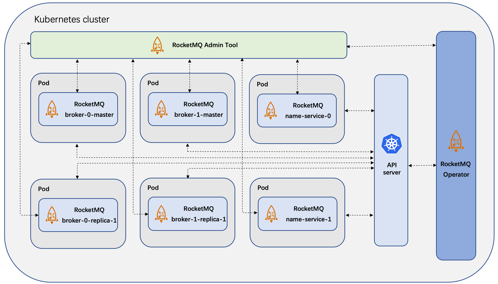

## RocketMQ Operator
[](https://www.apache.org/licenses/LICENSE-2.0.html)
[](https://golang.org/)

[](https://godoc.org/github.com/apache/rocketmq-operator/pkg)
[](https://goreportcard.com/report/github.com/apache/rocketmq-operator)
[](https://github.com/apache/rocketmq-operator/releases)

[](https://hub.docker.com/r/apache/rocketmq-operator)
[](https://hub.docker.com/r/apache/rocketmq-operator/tags)

[](http://isitmaintained.com/project/apache/rocketmq-operator "Average time to resolve an issue")
[](http://isitmaintained.com/project/apache/rocketmq-operator "Percentage of issues still open")
[](https://twitter.com/intent/follow?screen_name=ApacheRocketMQ)

## Table of Contents
- [Overview](#overview)
- [Quick Start](#quick-start)
  - [Deploy RocketMQ Operator](#deploy-rocketmq-operator)
  - [Prepare Volume Persistence](#prepare-volume-persistence)
    - [EmptyDir](#emptydir)
    - [HostPath](#hostpath)
    - [StorageClass (Use NFS for Example)](#storageclass-use-nfs-for-example)
  - [Define Your RocketMQ Cluster](#define-your-rocketmq-cluster)
  - [Create RocketMQ Cluster](#create-rocketmq-cluster)
  - [Verify the Data Storage](#verify-the-data-storage)
    - [Verify HostPath Storage](#verify-hostpath-storage)
    - [Verify NFS storage](#verify-nfs-storage)
- [Horizontal Scale](#horizontal-scale)
  - [Name Server Cluster Scale](#name-server-cluster-scale)
  - [Broker Cluster Scale](#broker-cluster-scale)
    - [Up-scale Broker in Out-of-order Message Scenario](#up-scale-broker-in-out-of-order-message-scenario)
- [Topic Transfer](#topic-transfer)
- [Clean the Environment](#clean-the-environment)
- [Development](#development)
  - [Prerequisites](#prerequisites)
  - [Build](#build)
    - [Operator](#operator)
    - [Broker and Name Server Images](#broker-and-name-server-images)
    - [Dashboard](#dashboard)

## Overview

RocketMQ Operator is to manage RocketMQ service instances deployed on the Kubernetes cluster.
It is built using the [Operator SDK](https://github.com/operator-framework/operator-sdk), which is part of the [Operator Framework](https://github.com/operator-framework/).



## Quick Start

### Deploy RocketMQ Operator

1. Clone the project on your Kubernetes cluster master node:
```
$ git clone https://github.com/apache/rocketmq-operator.git
$ cd rocketmq-operator
```

2. To deploy the RocketMQ Operator on your Kubernetes cluster, please run the following command:

```
$ make deploy
```

3. Use command ```kubectl get pods``` to check the RocketMQ Operator deploy status like:

```
$ kubectl get pods
NAME                                      READY   STATUS    RESTARTS   AGE
rocketmq-operator-564b5d75d-jllzk         1/1     Running   0          108s
```

If you find that pod image is not found, run the following command to build a new one locally,
the image tag is specified by the `IMG` parameter.

```shell
$ make docker-build IMG=apache/rocketmq-operator:0.4.0-snapshot
```

Now you can use the CRDs provided by RocketMQ Operator to deploy your RocketMQ cluster.

### Prepare Volume Persistence

Before RocketMQ deployment, you may need to do some preparation steps for RocketMQ data persistence. 

Currently we provide several options for your RocketMQ data persistence: ```EmptyDir```, ```HostPath``` and ```StorageClass```, which can be configured in CR files, for example in ```rocketmq_v1alpha1_nameservice_cr.yaml```:

```
...
 # storageMode can be EmptyDir, HostPath, StorageClass
  storageMode: HostPath
...
```

#### EmptyDir

If you choose ```EmptyDir```, you don't need to do extra preparation steps for data persistence. But the data storage life is the same with the pod's life, if the pod is deleted you may lost the data.

If you choose other storage modes, please refer to the following instructions to prepare the data persistence.

#### HostPath

This storage mode means the RocketMQ data (including all the logs and store files) is stored in each host where the pod lies on. You need to create a directory on the host where you want the RocketMQ data to be stored. For example:

```
$ mkdir /data/rocketmq/broker
```

You can configure the host path in the CRD yaml file like ```hostPath: /data/rocketmq/broker``` in the ```example/rocketmq_v1alpha1_rocketmq_cluster.yaml``` file.

#### StorageClass (Use NFS for Example)

If you choose StorageClass as the storage mode, you need to prepare the storage class related provisioner and other dependencies. Using the NFS storage class as an example, the first step is to prepare a storage class based on NFS provider to create PV and PVC where the RocketMQ data will be stored. 

1. Deploy NFS server and clients on your Kubernetes cluster. You can refer to [NFS deployment document](docs/en/nfs_install_en.md) for more details. Please make sure they are functional before you go to the next step. Here is a instruction on how to verify NFS service.

    1) On your NFS client node, check if NFS shared dir exists.
    ```
   $ showmount -e 192.168.130.32
   Export list for 192.168.130.32:
   /data/k8s * 
    ```
    2) On your NFS client node, create a test dir and mount it to the NFS shared dir (you may need sudo permission).
    ```
   $ mkdir -p   ~/test-nfc
   $ mount -t nfs 192.168.130.32:/data/k8s ~/test-nfc
    ```
    3) On your NFS client node, create a test file on the mounted test dir.
    ```
   $ touch ~/test-nfc/test.txt
    ```
   4) On your NFS server node, check the shared dir. If there exists the test file we created on the client node, it proves the NFS service is functional.
   ```
   $ ls -ls /data/k8s/
   total 4
   4 -rw-r--r--. 1 root root 4 Jul 10 21:50 test.txt
   ```

2. Modify the following configurations of the ```deploy/storage/nfs-client.yaml``` file:
``` 
...
            - name: NFS_SERVER
              value: 192.168.130.32
            - name: NFS_PATH
              value: /data/k8s
      volumes:
        - name: nfs-client-root
          nfs:
            server: 192.168.130.32
            path: /data/k8s
...
```
Replace ```192.168.130.32``` and ```/data/k8s``` with your true NFS server IP address and NFS server data volume path.
 
3. Create a NFS storage class for RocketMQ, run

```
$ cd deploy/storage
$ ./deploy-storage-class.sh
```

4. If the storage class is successfully deployed, you can get the pod status like:

```
$ kubectl get pods
NAME                                      READY   STATUS    RESTARTS   AGE
nfs-client-provisioner-7cf858f754-7vxmm   1/1     Running   0          136m
rocketmq-operator-564b5d75d-jllzk         1/1     Running   0          108s
```

### Define Your RocketMQ Cluster

RocketMQ Operator provides several CRDs to allow users define their RocketMQ service component cluster, which includes the Name Server, Broker cluster, Console, etc.

1. Check the file ```rocketmq_v1alpha1_rocketmq_cluster.yaml``` in the ```example``` directory which we put these CR together:
```
apiVersion: v1
kind: ConfigMap
metadata:
  name: broker-config
  namespace: default
data:
  # BROKER_MEM sets the broker JVM, if set to "" then Xms = Xmx = max(min(1/2 ram, 1024MB), min(1/4 ram, 8GB))
  BROKER_MEM: " -Xms2g -Xmx2g -Xmn1g "
  broker-common.conf: |
    # brokerClusterName, brokerName, brokerId are automatically generated by the operator and do not set it manually!!!
    deleteWhen=04
    fileReservedTime=48
    flushDiskType=ASYNC_FLUSH
    # set brokerRole to ASYNC_MASTER or SYNC_MASTER. DO NOT set to SLAVE because the replica instance will automatically be set!!!
    brokerRole=ASYNC_MASTER

---
apiVersion: rocketmq.apache.org/v1alpha1
kind: Broker
metadata:
  # name of broker cluster
  name: broker
  namespace: default
spec:
  # size is the number of the broker cluster, each broker cluster contains a master broker and [replicaPerGroup] replica brokers.
  size: 1
  # nameServers is the [ip:port] list of name service
  nameServers: ""
  # replicaPerGroup is the number of each broker cluster
  replicaPerGroup: 1
  # brokerImage is the customized docker image repo of the RocketMQ broker
  brokerImage: apacherocketmq/rocketmq-broker:4.5.0-alpine-operator-0.3.0
  # imagePullPolicy is the image pull policy
  imagePullPolicy: Always
  # resources describes the compute resource requirements and limits
  resources:
    requests:
      memory: "2048Mi"
      cpu: "250m"
    limits:
      memory: "12288Mi"
      cpu: "500m"
  # allowRestart defines whether allow pod restart
  allowRestart: true
  # storageMode can be EmptyDir, HostPath, StorageClass
  storageMode: EmptyDir
  # hostPath is the local path to store data
  hostPath: /data/rocketmq/broker
  # scalePodName is [Broker name]-[broker group number]-master-0
  scalePodName: broker-0-master-0
  # env defines custom env, e.g. BROKER_MEM
  env:
    - name: BROKER_MEM
      valueFrom:
        configMapKeyRef:
          name: broker-config
          key: BROKER_MEM
  # volumes defines the broker.conf
  volumes:
    - name: broker-config
      configMap:
        name: broker-config
        items:
          - key: broker-common.conf
            path: broker-common.conf
  # volumeClaimTemplates defines the storageClass
  volumeClaimTemplates:
    - metadata:
        name: broker-storage
      spec:
        accessModes:
          - ReadWriteOnce
        storageClassName: rocketmq-storage
        resources:
          requests:
            storage: 8Gi
---
apiVersion: rocketmq.apache.org/v1alpha1
kind: NameService
metadata:
  name: name-service
  namespace: default
spec:
  # size is the the name service instance number of the name service cluster
  size: 1
  # nameServiceImage is the customized docker image repo of the RocketMQ name service
  nameServiceImage: apacherocketmq/rocketmq-nameserver:4.5.0-alpine-operator-0.3.0
  # imagePullPolicy is the image pull policy
  imagePullPolicy: Always
  # hostNetwork can be true or false
  hostNetwork: true
  #  Set DNS policy for the pod.
  #  Defaults to "ClusterFirst".
  #  Valid values are 'ClusterFirstWithHostNet', 'ClusterFirst', 'Default' or 'None'.
  #  DNS parameters given in DNSConfig will be merged with the policy selected with DNSPolicy.
  #  To have DNS options set along with hostNetwork, you have to specify DNS policy
  #  explicitly to 'ClusterFirstWithHostNet'.
  dnsPolicy: ClusterFirstWithHostNet
  # resources describes the compute resource requirements and limits
  resources:
    requests:
      memory: "512Mi"
      cpu: "250m"
    limits:
      memory: "1024Mi"
      cpu: "500m"
  # storageMode can be EmptyDir, HostPath, StorageClass
  storageMode: EmptyDir
  # hostPath is the local path to store data
  hostPath: /data/rocketmq/nameserver
  # volumeClaimTemplates defines the storageClass
  volumeClaimTemplates:
    - metadata:
        name: namesrv-storage
      spec:
        accessModes:
          - ReadWriteOnce
        storageClassName: rocketmq-storage
        resources:
          requests:
            storage: 1Gi

---
apiVersion: rocketmq.apache.org/v1alpha1
kind: Console
metadata:
  name: console
  namespace: default
spec:
  # nameServers is the [ip:port] list of name service
  nameServers: ""
  # consoleDeployment define the console deployment
  consoleDeployment:
    apiVersion: apps/v1
    kind: Deployment
    metadata:
      labels:
        app: rocketmq-console
    spec:
      replicas: 1
      selector:
        matchLabels:
          app: rocketmq-console
      template:
        metadata:
          labels:
            app: rocketmq-console
        spec:
          containers:
            - name: console
              image: apacherocketmq/rocketmq-console:2.0.0
              ports:
                - containerPort: 8080
```

The yaml defines the RocketMQ name server and broker cluster scale, the [ip:port] list of name service and so on. By default, the nameServers is an empty string which means it is automatically obtained by the operator.

> Notice: Currently the broker image use the formula ```max(min(1/2 ram, 1024MB), min(1/4 ram, 8GB))``` to calculate JVM Xmx size in which ```ram``` is the host memory size. If the memory resource limit is lower than the container requirement, it may occur the ```OOMkilled``` error.

### Create RocketMQ Cluster

1. Deploy the RocketMQ name service cluster by running:

``` 
$ kubectl apply -f example/rocketmq_v1alpha1_rocketmq_cluster.yaml
broker.rocketmq.apache.org/broker created
nameservice.rocketmq.apache.org/name-service created
console.rocketmq.apache.org/console created
```

The name server cluster will be created first, after all name server cluster is in running state, the operator will create the broker cluster.

Check the status:

```
$ kubectl get pods -owide
NAME                                 READY   STATUS    RESTARTS   AGE    IP             NODE             NOMINATED NODE   READINESS GATES
broker-0-master-0                    1/1     Running   0          71s    10.1.5.91      docker-desktop   <none>           <none>
broker-0-replica-1-0                 1/1     Running   0          71s    10.1.5.92      docker-desktop   <none>           <none>
console-5c4c9d5757-jnsbq             1/1     Running   0          71s    10.1.5.93      docker-desktop   <none>           <none>
name-service-0                       1/1     Running   0          78s    192.168.65.3   docker-desktop   <none>           <none>
rocketmq-operator-758bb9c774-jrfw4   1/1     Running   0          106s   10.1.5.90      docker-desktop   <none>           <none>
```

Using the default yaml, we can see that there are 2 name-server Pods and 1 master broker 1 replica(slave) broker running on the k8s cluster.

2. Apply Service and visit the RocketMQ Console.

By default, we use nodePort service to expose the console service outside the k8s cluster:
```
$ kubectl apply -f example/rocketmq_v1alpha1_cluster_service.yaml
```
Then you can visit the RocketMQ Console (by default) by the URL ```any-k8s-node-IP:30000```, or ```localhost:30000``` if you are currently on the k8s node.

3. If you are using storage class, check the PV and PVC status:
```
$ kubectl get pvc
NAME                                    STATUS   VOLUME                                     CAPACITY   ACCESS MODES   STORAGECLASS       AGE
broker-storage-broker-0-master-0        Bound    pvc-7a74871b-c005-441a-bb15-8106566c9d19   8Gi        RWO            rocketmq-storage   78s
broker-storage-broker-0-replica-1-0     Bound    pvc-521e7e9a-3795-487a-9f76-22da74db74dd   8Gi        RWO            rocketmq-storage   78s
namesrv-storage-name-service-0          Bound    pvc-c708cb49-aa52-4992-8cac-f46a48e2cc2e   1Gi        RWO            rocketmq-storage   79s

$ kubectl get pv
NAME                                       CAPACITY   ACCESS MODES   RECLAIM POLICY   STATUS   CLAIM                                       STORAGECLASS       REASON   AGE
pvc-521e7e9a-3795-487a-9f76-22da74db74dd   8Gi        RWO            Delete           Bound    default/broker-storage-broker-0-replica-1-0 rocketmq-storage            79s
pvc-7a74871b-c005-441a-bb15-8106566c9d19   8Gi        RWO            Delete           Bound    default/broker-storage-broker-0-master-0    rocketmq-storage            79s
pvc-d7b76efe-384c-4f8d-9e8a-ebe209ba826c   8Gi        RWO            Delete           Bound    default/broker-storage-broker-1-master-0    rocketmq-storage            78s
```

> Notice: if you don't choose the StorageClass storage mode, then the above PV and PVC won't be created.

Congratulations! You have successfully deployed your RocketMQ cluster by RocketMQ Operator.

### Verify the Data Storage

#### Verify HostPath Storage
Access on any node which contains the RocketMQ service pod, check the ```hostPath``` you configured, for example:
```
$ ls /data/rocketmq/broker
logs  store

$ cat /data/rocketmq/broker/logs/broker-1-replica-1/rocketmqlogs/broker.log
...
2019-09-12 13:12:24 INFO main - The broker[broker-1, 10.244.3.35:10911] boot success. serializeType=JSON and name server is 192.168.130.35:9876
...
```

#### Verify NFS storage
Access the NFS server node of your cluster and verify whether the RocketMQ data is stored in your NFS data volume path:

```
$ cd /data/k8s/

$ ls
default-broker-storage-broker-0-master-0-pvc-7a74871b-c005-441a-bb15-8106566c9d19   
default-broker-storage-broker-0-replica-1-0-pvc-521e7e9a-3795-487a-9f76-22da74db74dd  
default-namesrv-storage-name-service-0-pvc-c708cb49-aa52-4992-8cac-f46a48e2cc2e

$ ls default-broker-storage-broker-0-master-0-pvc-7a74871b-c005-441a-bb15-8106566c9d19/logs/rocketmqlogs/
broker_default.log  broker.log  commercial.log  filter.log  lock.log  protection.log  remoting.log  stats.log  storeerror.log  store.log  transaction.log  watermark.log

$ cat default-broker-storage-broker-0-master-0-pvc-7a74871b-c005-441a-bb15-8106566c9d19/logs/rocketmqlogs/broker.log 
...
2019-09-10 14:12:22 INFO main - The broker[broker-1-master-0, 10.244.2.117:10911] boot success. serializeType=JSON and name server is 192.168.130.33:9876
...
```

## Horizontal Scale

### Name Server Cluster Scale
If the current name service cluster scale does not fit your requirements, you can simply use RocketMQ-Operator to up-scale or down-scale your name service cluster.

If you want to enlarge your name service cluster. Modify your name service CR file ```rocketmq_v1alpha1_nameservice_cr.yaml```, increase the field ```size``` to the number you want, for example, from ```size: 1``` to ```size: 2```.

> Notice: if your broker image version is 4.5.0 or earlier, you need to make sure that ```allowRestart: true``` is set in the broker CR file to enable rolling restart policy. If ```allowRestart: false```, configure it to ```allowRestart: true``` and run ```kubectl apply -f example/rocketmq_v1alpha1_broker_cr.yaml``` to apply the new config.

After configuring the ```size``` fields, simply run 
```
kubectl apply -f example/rocketmq_v1alpha1_nameservice_cr.yaml 
```
Then a new name service pod will be deployed and meanwhile the operator will inform all the brokers to update their name service list parameters, so they can register to the new name service.

> Notice: under the policy ```allowRestart: true```, the broker will gradually be updated so the update process is also not perceptible to the producer and consumer clients.

### Broker Cluster Scale

#### Up-scale Broker in Out-of-order Message Scenario
It is often the case that with the development of your business, the old broker cluster scale no longer meets your needs. You can simply use RocketMQ-Operator to up-scale your broker cluster:

1. Modify the ```size``` in the broker CR file to the number that you want the broker cluster scale will be, for example, from ```size: 1``` to ```size: 2```.

2. Choose the source broker pod, from which the old metadata like topic and subscription information data will be transferred to the newly created brokers. The source broker pod field is 
```
...
# scalePodName is broker-[broker group number]-master-0
  scalePodName: broker-0-master-0
...
```

3. Apply the new configurations:
```
$ kubectl apply -f example/rocketmq_v1alpha1_broker_cr.yaml
```
Then a new broker group of pods will be deployed and meanwhile the operator will copy the metadata from the source broker pod to the newly created broker pods before the new brokers are stared, so the new brokers will reload previous topic and subscription information.

## Topic Transfer

```Topic Transfer``` means that the user wants to migrate the work of providing service for a specific topic from a source(original) cluster to a target cluster without affecting the business. This may happen when the source cluster is about to shutdown, or the user wants to reduce the workload on the source cluster.

Usually the ```Topic Transfer``` process consists of 7 steps:

* Add all consumer groups of the topic to the target cluster.

* Add the topic to be transferred to the target cluster. 

* Forbid new message writing into the source cluster.

* Check the consumer group consumption progress to make sure all messages in the source cluster have been consumed.

* Delete the topic in the source cluster when all messages in the source cluster have been consumed.

* Delete the consumer groups in the source cluster.

* Add the retry-topic to the target cluster.

The ```TopicTransfer``` CRD can help you do that. Simply configure the CR file ```example/rocketmq_v1alpha1_topictransfer_cr.yaml```:

```
apiVersion: rocketmq.apache.org/v1alpha1
kind: TopicTransfer
metadata:
  name: topictransfer
spec:
  # topic defines which topic to be transferred
  topic: TopicTest
  # sourceCluster define the source cluster
  sourceCluster: broker-0
  # targetCluster defines the target cluster
  targetCluster: broker-1
```

Then apply the ```TopicTransfer``` resource:

```
$ kubectl apply -f example/rocketmq_v1alpha1_topictransfer_cr.yaml
```

The operator will automatically do the topic transfer job. 

If the transfer process is failed, the operator will roll-back the transfer operations for the atomicity of the ```TopicTransfer``` operation.

You can check the operator logs or consume progress status to monitor and verify the topic transfer process:

```
$ kubectl logs -f [operator-pod-name] 
```

```
$ sh bin/mqadmin consumerprogress -g [consumer-group] -n [name-server-ip]:9876
```

## Clean the Environment

If you want to tear down the RocketMQ cluster, to remove the name server and broker clusters run

```
$ kubectl delete -f example/rocketmq_v1alpha1_rocketmq_cluster.yaml
$ kubectl delete -f example/rocketmq_cluster_service.yaml
```

to remove the RocketMQ Operator:

```
$ ./purge-operator.sh
```

to remove the storage class for RocketMQ:

```
$ cd deploy/storage
$ ./remove-storage-class.sh
```

> Note: the StorageClass and HostPath persistence data will not be deleted by default.

## Development

### Prerequisites

+ [git](https://git-scm.com/downloads)
+ [go](https://golang.org/dl/) version v1.16.
+ [mercurial](https://www.mercurial-scm.org/downloads) version 3.9+
+ [docker](https://docs.docker.com/install/) version 19.03+.
+ Access to a Kubernetes v1.19 or above cluster.
+ [dep](https://golang.github.io/dep/docs/installation.html) version v0.5.0+.
+ [operator-sdk](https://github.com/operator-framework/operator-sdk) version v1.16.0-v1.21.0

### Build

For developers who want to build and push the operator-related images to the docker hub, please follow the instructions below.

#### Operator

RocketMQ-Operator uses ```operator-sdk``` to generate the scaffolding and build the operator image. You can refer to the [operator-sdk user guide](https://sdk.operatorframework.io/docs/) for more details.


If you want to build your own operator image and push it to your own docker hub, please specify `IMG` as your image url and run `make docker-build` and `make docker-push`. For example: 
```shell
$ make docker-build IMG={YOUR_IMAGE_URL} && make docker-push IMG={YOUR_IMAGE_URL}
```

#### Broker and Name Server Images

RocketMQ-Operator is based on customized images of ```Broker``` and ```Name Server```, which are build by ```build-broker-image.sh``` and ```build-namesrv-image.sh``` respectively. Therefore, the images used in the ```Broker``` and ```NameService``` CR yaml files should be build by these scripts.

You can also modify the ```DOCKERHUB_REPO``` variable in the scripts to push the newly build images to your own repository:

```
$ cd images/alpine/broker
$ ./build-broker-image.sh
```

```
$ cd images/alpine/namesrv
$ ./build-namesrv-image.sh
```

#### Dashboard

The Console CR directly uses the RocketMQ Dashboard image from https://github.com/apache/rocketmq-docker/blob/master/image-build/Dockerfile-centos-dashboard, which has no customization for the operator. 

> Note: For users who just want to use the operator, there is no need to build the operator and customized broker and name server images themselves. Users can simply use the default official images which are maintained by the RocketMQ community. 
